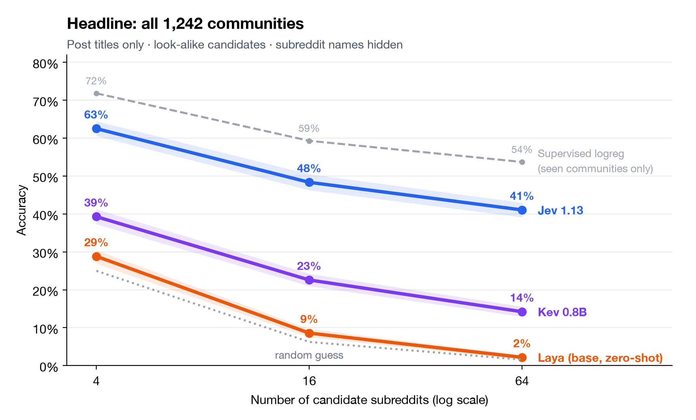

# Social Routing Bench

Given a Reddit post title and a set of candidate subreddits that changes for every example, pick the subreddit the post was published in. The candidate set is built at runtime (4–64 options, random / semantically close / hard look-alike negatives), so a model cannot memorise a fixed label space, and candidates can be shown by **name** or by **description only** — which separates understanding what a community is about from recognising its name.

> **Public alpha.** Results below cover the models run so far; more models will be added. Contributions, model requests and benchmark feedback are welcome via Issues.

## Results so far

`medium` preset: 2,484 post titles (2 per community, 1,242 communities), identical posts, candidates and display order for every model. Headline: **hard look-alike candidates, subreddit names hidden**. 95% bootstrap intervals in brackets.

| Model | Setting | All communities, K = 16 | All communities, K = 64 | Seen communities, K = 16 | Seen communities, K = 64 |
|---|---|---:|---:|---:|---:|
| Supervised logreg | trained, ~190 titles per community | — | — | 0.593 | 0.537 |
| [Jev 1.13](results/jev-medium/run.json) | zero-shot, `typesafe/jev-1.13-20260917` | **0.483** [0.463, 0.505] | **0.411** [0.391, 0.430] | 0.454 | 0.386 |
| [Kev 0.8B](results/kev-0.8b-medium/run.json) | zero-shot, `jaredpalmer/kev-0.8b@9a45d25e` | 0.226 [0.210, 0.242] | 0.142 [0.129, 0.156] | 0.211 | 0.132 |
| [Laya](results/laya-medium/run.json) | base checkpoint, zero-shot, multilingual `@f2b4faf5` | 0.086 [0.075, 0.097] | 0.022 [0.017, 0.028] | 0.088 | 0.021 |
| Random guess | — | 0.063 | 0.016 | 0.063 | 0.016 |



- **Jev 1.13** is the strongest zero-shot model and does not depend on subreddit names: names vs descriptions differ by less than 1 pp ([chart](results/names-vs-descriptions.png)).
- **Kev 0.8B** is far smaller and well above chance, also name-independent.
- **Laya** is a base checkpoint meant for fine-tuning; zero-shot it relies on names and is near chance with descriptions only.
- **Supervised logreg** (title embeddings, `BAAI/bge-small-en-v1.5`) only exists for seen communities, because unseen ones have no training posts. A model trained on ~190 titles per community is still ~15 pp ahead of the best zero-shot model.
- About 5% of hard examples (10% at K = 64) cannot be answered from the title alone ([ambiguity estimate](tasks/subreddit_dynamic/ambiguity.md)).

Full per-slice metrics (random / semantic / hard, K = 4 / 16 / 64, names / descriptions, seen / unseen, calibration) are in each `results/*/metrics.json`. Limitations: titles only; the source data is old and public, so pretraining exposure to these titles cannot be excluded.

## Quick start

Python 3.11–3.13.

```bash
git clone https://github.com/s0NRAYY/RedditClassificationBench && cd RedditClassificationBench
python -m pip install -e .
hf download sonrayll/social-routing-bench --repo-type dataset \
  --revision 56345ac1a2998131d2aa0e0dddf1c670ca14b155 \
  --local-dir data/subreddit_dynamic

srb models list
srb sanity MODEL          # 10 unambiguous posts; below 0.8 means the adapter or prompt format is suspect
srb run MODEL --dataset data/subreddit_dynamic \
  --task-config tasks/subreddit_dynamic/medium.yaml --output results/MODEL
```

The dataset build is on Hugging Face as [`sonrayll/social-routing-bench`](https://huggingface.co/datasets/sonrayll/social-routing-bench); pin the revision for reproducible results.

## Running models

The CLI resolves known [Jev Decision Index](https://huggingface.co/spaces/multimodalart/jev-decision-index) models to isolated runtime workers. Install only the runtime a model needs, e.g. `pip install -e '.[gliner2]'`, `'.[laya]'`, `'.[transformers-predict]'`. Built-in worker families: System One HTTP, Surogate, OpenJev, Intern-Decision, Transformers models exposing `predict`, GLiNER2, and Laya.

**Jev** runs through OpenRouter's native System One endpoint; only an OpenRouter API key is needed:

```bash
srb configure typesafe/jev-1.13
srb run typesafe/jev-1.13 --dataset data/subreddit_dynamic \
  --task-config tasks/subreddit_dynamic/medium.yaml --output results/jev-medium
```

`~typesafe/jev-latest` is also registered but follows new releases; prefer the versioned ID for published results.

**HTTP models** (System One / Surogate servers such as Kev): on the first run the CLI prompts for the endpoint and API key and saves them per model in `~/.config/social-routing-bench/credentials.json` (mode `0600`). The key is masked while typing and reaches the worker only through its environment, never process arguments or run metadata. `srb configure MODEL` changes saved credentials. HTTP runs record the server-reported model version as `served_model`, refuse to resume against a different version, retry transient 429/5xx and dropped connections, and record provider-reported cost.

**Any other model** can use an external JSONL worker without adding its dependencies to the benchmark process:

```bash
srb run hf://owner/model --command-worker "python my_worker.py" \
  --dataset data/subreddit_dynamic --output results/model
```

The worker answers `{"type":"hello","protocol":1}` with its limits, modalities, batching support and probability source (`native`, `self_reported`, or `none`). Prediction messages contain `state` and typed `questions`; results return choices, optional probability distributions, usage, timing and forward counts. See `tests/support_worker.py` for the complete minimal protocol.

## Presets and outputs

Choose a matrix with `--task-config` (sizes and timings in `tasks/subreddit_dynamic/README.md`): `smoke.yaml` checks plumbing, `medium.yaml` is the comparison preset (44,712 predictions per model), and `task.yaml` is the full matrix. If a worker declares `max_options` below a requested K, that K is skipped and listed as `skipped_candidate_counts` in `run.json`; candidates are never truncated. Runs are resumable at prediction granularity.

Each run writes `run.json`, `predictions.jsonl`, `metrics.json` and `metrics.csv`. Every prediction row keeps the full record — ordered candidates, the chosen option, the complete probability vector and any extra model output — so new metrics can be computed without rerunning. Accuracy with a 95% bootstrap interval, macro community accuracy, latency, tokens and cost are always reported; NLL, Brier, ECE-15 and AURC only for models that return probabilities. Label-only models are never assigned fabricated confidence.

Compare compatible runs (requires local `predictions.jsonl`):

```bash
srb compare results/jev-medium results/kev-0.8b-medium --output results/comparison.json
```

## Build the dataset from source

Only needed for a new source archive. The upstream public archive ([TheShadow29/subreddit-classification-dataset](https://github.com/TheShadow29/subreddit-classification-dataset): `cleaned_all_title_data_top.csv`, `req_subreddits.csv`) contains titles only; build it with `--source-mode title-only`, whose `build.json` exposes only the `title` mode:

```bash
build-subreddit-dynamic --source-mode title-only \
  --posts data/raw/cleaned_all_title_data_top.csv \
  --communities data/raw/req_subreddits.csv \
  --output data/subreddit_dynamic
```

An archive with post bodies (`selftext`, `body`, or `text`) and post IDs builds a paired track where `title` and `title+selftext` are views over the same posts. The negative-mining embedding model and revision are frozen in `tasks/subreddit_dynamic/task.yaml`.

## Runtime notices

- Python 3.14 is excluded because current Torch/GLiNER releases warn that their TorchScript path is unsupported.
- Set `HF_TOKEN` to remove the Hugging Face unauthenticated-download notice.
- GLiNER2 may report that its `extractor` configuration loads through Transformers and that DeBERTa falls back from SDPA to eager attention; both come from the upstream runtime.
- Runtime warnings are not suppressed globally; a new warning should be treated as a compatibility signal.

## Provenance, license and citation

Source titles and community metadata come from [TheShadow29/subreddit-classification-dataset](https://github.com/TheShadow29/subreddit-classification-dataset) (MIT). Reddit content remains subject to Reddit's terms and the rights of its authors. Model weights are downloaded by their runtimes and are not redistributed here.

Benchmark code is released under the MIT License (`LICENSE`). Citation metadata is in `CITATION.cff`.
